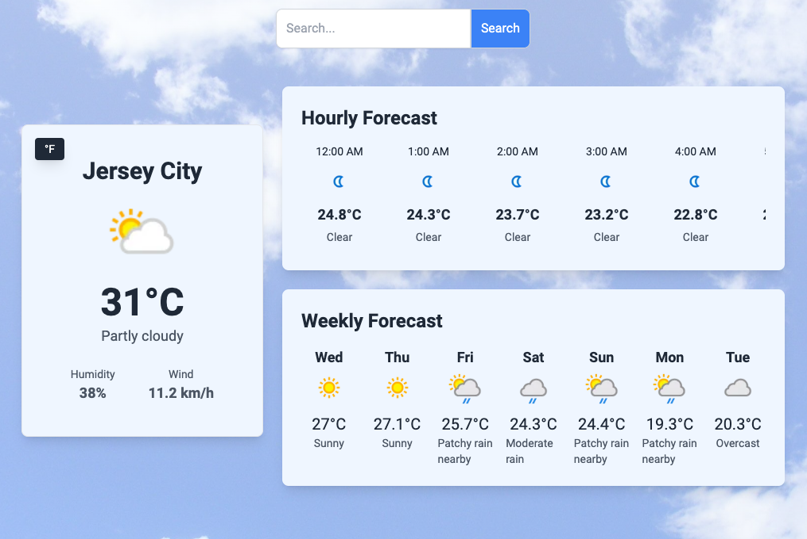
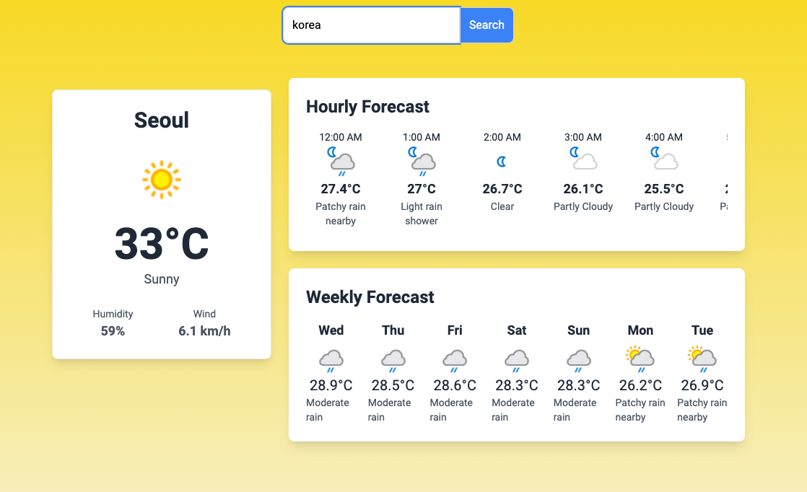
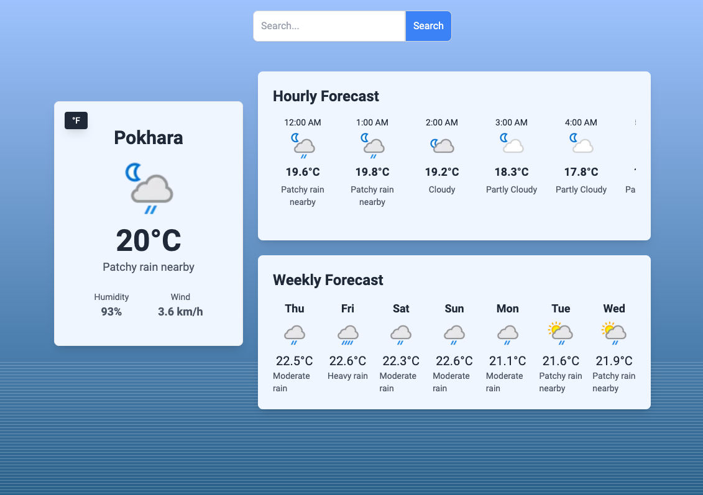
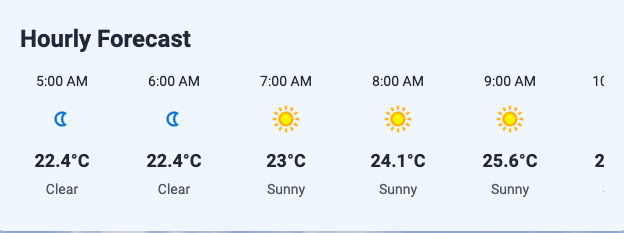
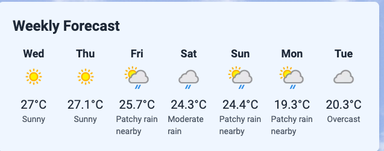
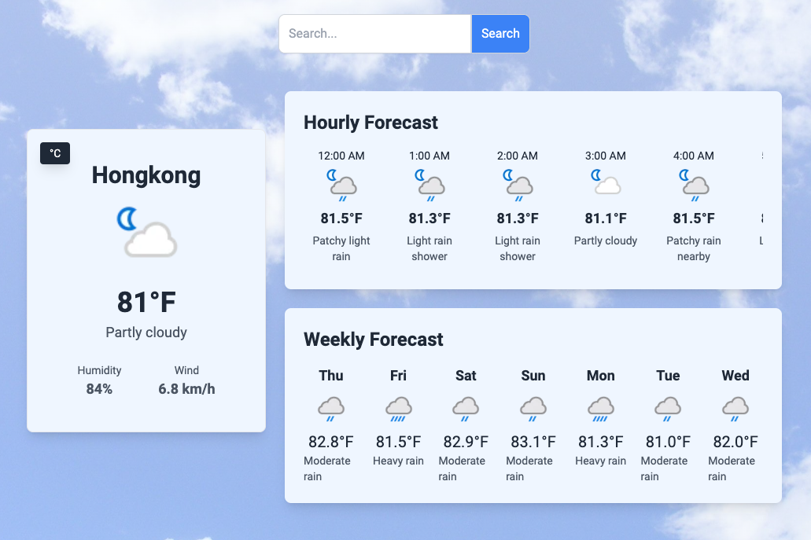

# Weather App

A React application for viewing weather information. This project displays current weather conditions, hourly forecasts, and weekly forecasts. It allows users to search for weather data by location or by using their current geographic location.

## Features

- **Current Weather**: Displays current temperature, weather conditions, and an icon representing the weather.
- **Hourly Forecast**: Shows the weather forecast for the next 24 hours, including temperature and condition.
- **Weekly Forecast**: Provides a 7-day weather forecast with daily temperatures and conditions.
- **Unit Toggle**: Allows users to switch between Celsius and Fahrenheit for temperature readings.
- **Search Functionality**: Users can search for weather data based on a location name or coordinates.
- **Geolocation**: Fetches weather data based on the user's current location.

## Technologies

- **React**: JavaScript library for building user interfaces.
- **Tailwind CSS**: Utility-first CSS framework for styling.
- **WeatherAPI**: API used for fetching weather data.

## Installation

- **To set up the project locally, follow these steps:**

### Clone the Repository

- **git clone https://github.com/Jeneliya12/weatherapp.git**

### Install Dependencies

- **cd WEATHER_APP**
- **npm install**
- **Note**: Install the tailwind from the official website:[tailwind](https://tailwindcss.com/docs/guides/create-react-app)

### Create a '.env' File

- **VITE_WEATHER_API_KEY=your_weather_api_key**

### Start the Development Server

- **npm run dev**

## Components

- **mainsection**:Manages the layout of the page, including CurrentWeather, HourlyForecast, and WeeklyForecast components.

- **currentweather**:Displays current weather data and allows toggling between Celsius and Fahrenheit.

- **hourlyforecast**:Shows a horizontal scrollable list of hourly forecasts for the next 24 hours.

- **weeklyforecast**:Displays a 7-day forecast with daily weather information.

- **weathereffect**:Provides visual effects based on current weather conditions.

## Context

- **WeatherContext**: Manages global state for weather data, loading state, error handling, unit of measurement, and search functionality.

## API Integration

- **Current Weather**: https://api.weatherapi.com/v1/current.json?key=YOUR_API_KEY&q=QUERY

  - **For e.g**:
  - **q = “New York**” -**API_KEY: Your Api Key**

- **Hourly Forecast**: https://api.weatherapi.com/v1/forecast.json?key=YOUR_API_KEY&q=QUERY&hours=24

  - **q = “New York”**
  - **API_KEY: Your Api Key**

- **Weekly Forecast**: https://api.weatherapi.com/v1/forecast.json?key=YOUR_API_KEY&q=QUERY&days=7
  - **q = “New York”**
  - **API_KEY: Your Api Key**

## Functions:

- **fetchWeatherData(lat, lon)**: Fetches current, hourly, and weekly weather data based on latitude and longitude.

- **fetchWeatherDataByQuery(query)**: Fetches weather data based on a location query.

- **fetchWeatherDataByLocation()**: Fetches weather data based on the user's current location.

## Customization

- **Styles**: Modify Tailwind CSS classes to fit your design preferences.
- **API Key**: Ensure to replace your_weather_api_key in the .env file with your actual API key from WeatherAPI.

## Screenshots:

- **Weather details based on User's Location**

- **Weather details based on User's preferred City when the weathereffect = "Sunny"**

- **Weather details based on User's preferred City when the weathereffect = "Rainy"**

- **Hourly Forecast**:
  

- **Weekly Forecast**:

- **Temperature Conversion From Celsius to Fahrenheit**

